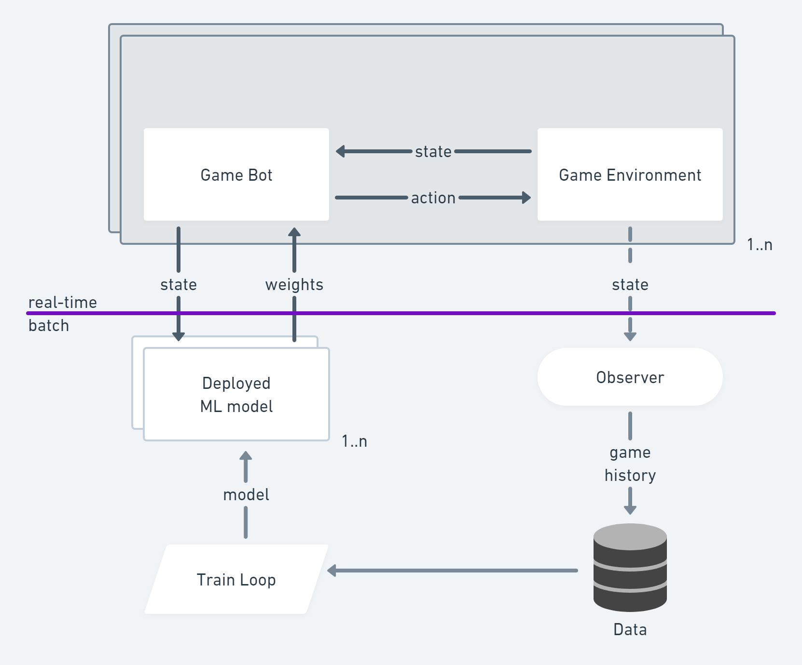

# Game Bot ML Design Doc

## 1. Overview
Design, develop and deploy into Production Reinforcement Learning based Game Bot agent.       

## 2. Motivation & Success metrics
It is expected that such bots will get much better game scores in game environments like https://dojorena.io/. 

Usually game environments has several games to choose and each game has own rules. Bots represented the players participate in a game and play against each other by following game rules. In case of some successful actions bots are nominated with game bonuses. The sum of such bonuses gives game score and the goal for the bot is to maximize such game score.

Success metrics: 
- *formally* - if we get better game score then we are doing better.
- *theoretically* - we expect that ML-based Game Bot should get better scores in a game environment than other bots.
- *practically* - we have a lot of risks why that could not happen. See 5.9. Risks & Uncertainties
- *pragmatic approach* - we can assume we have already a human-implemented `ML-ready` Game Bot. By saying `ML-ready` we mean - it contains a set of features or/and strategies to be selected for a given situation. The default behaviour could be random or hardcode. The goal of ML is to optimize a feature or strategy selection.
- *way of the samurai* - any steps we do toward the goal are valuable for us in this project.

## 3. Requirements & Constraints
Game Bots are doing actions selection at game time. Utilizing Machine Learning should give extra information for making better decisions what action to select in given situation. It is also very interesting to get some feedback about budget and time constrains required to run such systems in production. 
At the beginning we have the following constrains:
- Game Bot response time (decision) < 1s
- Infra budget: $300-500 per month 

### 3.1 What's in-scope & out-of-scope?
Image (game screen) recognition is out of scope. We consider we could get game information in structured text format. 

## 4. Methodology

### 4.1. Problem statement
It is hard and costly to implement Reinforcement Learning only based game bot. In this project we'd like to mix human-created strategies together with Reinforcement Learning base hints or priorities which strategy to use. 

### 4.2. Data
We assume that the game consists of limited number of steps. Each step have a game state related to this step. Game history is a full set of such steps.
Set of game histories is our input data.

### 4.3. Techniques
The standard way to solve the problem is to give an opportunity to a developer to design and implement the bot in a code as set of strategies. But sometimes (always) it is hard to find the right balance between them. Also, it is not clear how to integrate the `learning`. Again the standard way is to change the code.     

Recent deep reinforcement learning strategies have been able to deal with high-dimensional continuous state spaces through complex heuristics.
The games such as Atari, Chess and sudoku are incredibly difficult for humans to master and to make the machines perform well at tasks, which are known to represent human intellect is a phenomenal achievement. These models have shown great improvement in the past couple of years, assuring that reinforcement learning will finally get the attention it deserves.

Reinforcement Learning has four essential elements:
- Agent. The program you train, with the aim of doing a job you specify.
- Environment. The world, real or virtual, in which the agent performs actions.
- Action. A move made by the agent, which causes a status change in the environment.
- Rewards. The evaluation of an action, which can be positive or negative.

In our case Game Bot is an Agent, Game Environment is an Environment, possible bots actions in a game are our Actions and potential game bonuses are our Rewards.     

Observer (see High-level design below) will collect individual game steps over public API (json over websockets). It will save it as set of game histories. Later such game histories should be normalized, batched and passed to the Training Loop. It is expected that Machine Learning will help to select best game action.   

### 4.4. Experimentation & Validation
Game Bot and related ML models will be evaluating in some online game environments. As such games are quite random - some repeatable set of experiments will be used for a given model.   

### 4.5. Human-in-the-loop
A game bot developer is expected to write and implement set of game strategies or features. Machine Learning (Reinforcement Learning) models should provide some weights or priorities which strategy or feature to use in a given game situation.

## 5. Implementation

### 5.1. High-level design

### 5.2. Infra
- cloud-based deployment.
- cloud agnostic deployment - nice to have
- kubernetes based deployment - nice to have
- initial setup: AWS

### 5.3. Non-functional requirements: Constraints, Performance (Throughput, Latency)
- game bot response latency: <1s
- number of parallel game bots: 1-100
- number of parallel game environments: 1-20 
- number of RL/ML model: 1
- number of RL/ML model deployment: 1..n
- number of training loops: limited only by time and resources 
- number of parallel training loops: 1 

### 5.4. Security
- game bot connects to a game environment with API key
- in tournament mode - it is important to have API key /connectivity to public game environment secure
- in training / simulation mode - game environment assumed to be private, not exposed to the internet and security is less important

### 5.5. Data privacy
As game events are public - game data assumed to be public data.
Trained model is assumed as research project. So it is considered as public data as well.  

### 5.6. Monitoring & Alarms
Because of cloud agnostic deployment the following technologies are initial target
- grafana
- prometeus
- ELK (optional)

But this is yet clear how good is the given tech stack to ML Ops.

### 5.7. Cost
Cost breakdown:
- storage
  - our storage will slowly increase with more and more game histories. We do not expect that we will be able to run too many experiments
  - we also need some storage for ML-model with some backups
  - options:
    - kubernetes-based (pod) DB instance like PostgreSQL
    - file-based database
    - shared folders with set of files: csv / json / yaml / xml
- compute:
  - kubernetes cluster: 3..5 nodes
  - in case of increasing/decreasing load we can change number of kubernetes nodes
  - ML-compute: one training in a time
  - other
 
- total: $300-500 per month
- breakdown:
  - storage: $50 
  - compute
    - kubernetes: $100-200
    - ML-compute: $100-250 (no real experience)

### 5.8. Integration points
Game Environment is our main integration point. Usually this is a custom real-time JSON over Web Sockets protocol.
It is assumed that Game Environment provides sample clients in a different languages.
Data parsing and normalization is required.
Data collection and batching is required.

### 5.9. Risks & Uncertainties
Model quality
Data accuracy
Model evaluation accuracy
Training time
Infra cost

## 6. References
- [RL @illya13](https://illya13.github.io/RL/)
- [Coding DOJO](https://dojorena.io/)
