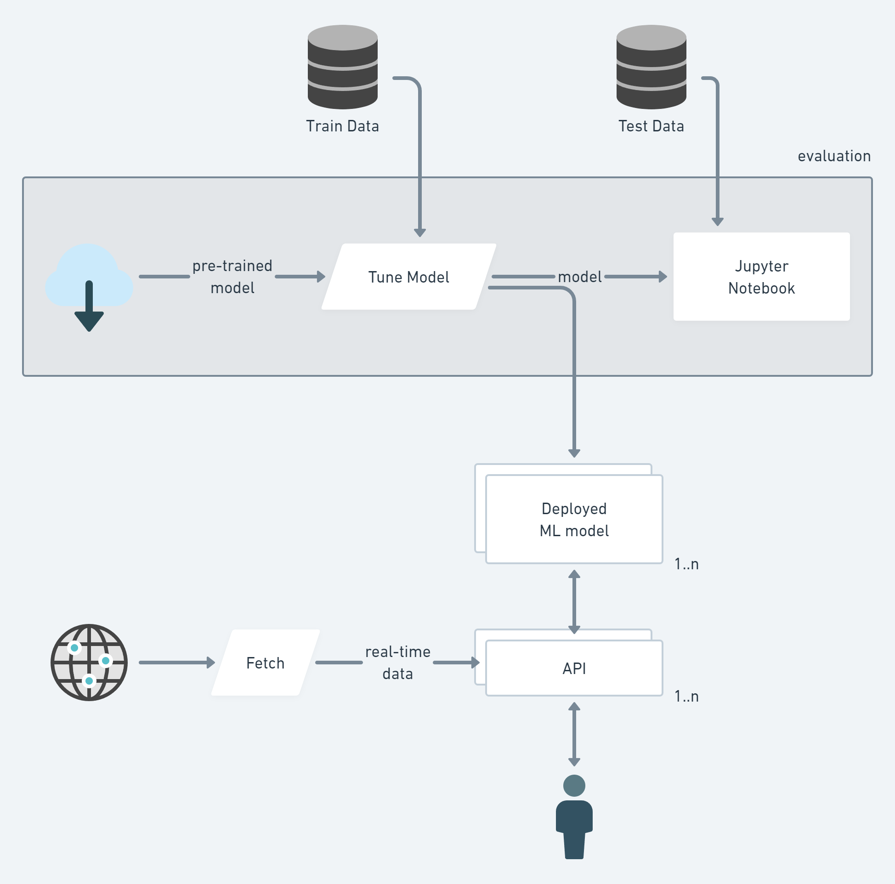

# Named Entity-Recognition & Sentiment Analysis ml-design-doc

## 1. Overview
Utilize existing pre-trained ML models for Named Entity-Recognition and Sentiment Analysis for financial news feeds.

## 2. Motivation & Success metrics
In a modern fast changing world it is important to get some hints our of real-time news feeds. Machine Learning could help with these use cases. Utilizing existing pre-trained ML models should save time / cost.     

## 3. Requirements & Constraints
We start with limited numbers of users who access system over API and limited number of news feeds. But the system should be scalable for potential grows.

### 3.1 What's in-scope & out-of-scope?
Trends, trends visualization, analytical reports are out of scope.

## 4. Methodology

### 4.1. Problem statement
How will you frame the problem? For example, fraud detection can be framed as an unsupervised (outlier detection, graph cluster) or supervised problem (e.g., classification).

### 4.2. Data
What data will you use to train your model? What input data is needed during serving?

### 4.3. Techniques
What machine learning techniques will you use? How will you clean and prepare the data (e.g., excluding outliers) and create features?

### 4.4. Experimentation & Validation
How will you validate your approach offline? What offline evaluation metrics will you use?
If you're A/B testing, how will you assign treatment and control (e.g., customer vs. session-based) and what metrics will you measure? What are the success and [guardrail](https://medium.com/airbnb-engineering/designing-experimentation-guardrails-ed6a976ec669) metrics?

### 4.5. Human-in-the-loop
How will you incorporate human intervention into your ML system (e.g., product/customer exclusion lists)?

## 5. Implementation

### 5.1. High-level design

### 5.2. Infra
- cloud-based deployment.
- cloud agnostic deployment - nice to have
- kubernetes based deployment - nice to have
- initial setup: AWS

### 5.3. Performance (Throughput, Latency)
- for a given end-user the API response time should be acceptable: <3s
- number of concurrent users: 1-10
- number of news feeds: 1-10 
- number of RL/ML model: 1..n
- number of training loops: 1

### 5.4. Security
- game bot connects to a game environment with API key
- in tournament mode - it is important to have API key /connectivity to public game environment secure
- in training / simulation mode - game environment assumed to be private, not exposed to the internet and security is less important

### 5.5. Data privacy
As game events are public - game data assumed to be public data.
Trained model is assumed as research project. So it is considered as public data as well.

### 5.6. Monitoring & Alarms
Because of cloud agnostic deployment the following technologies are initial target
- grafana
- prometeus
- ELK (optional)
  But this is yet clear how good is the given tech stack to ML Ops.

### 5.7. Cost
$300-500 per month

### 5.8. Integration points
Game Environment is our main integration point. Usually this is a custom real-time JSON over Web Sockets protocol.
It is assumed that Game Environment provides sample clients in a different languages.
Data parsing and normalization is required.
Data collection and batching is required.

### 5.9. Risks & Uncertainties
Model quality
Data accuracy
Model evaluation accuracy
Training time
Infra cost

## 6. Appendix

### 6.1. Alternatives

What alternatives did you consider and exclude? List pros and cons of each alternative and the rationale for your decision.

### 6.2. Experiment Results

Share any results of offline experiments that you conducted.

### 6.3. Performance benchmarks

Share any performance benchmarks you ran (e.g., throughput vs. latency vs. instance size/count).

### 6.4. Milestones & Timeline

What are the key milestones for this system and the estimated timeline?

### 6.5. Glossary

Define and link to business or technical terms.

### 6.6. References

Add references that you might have consulted for your methodology.
